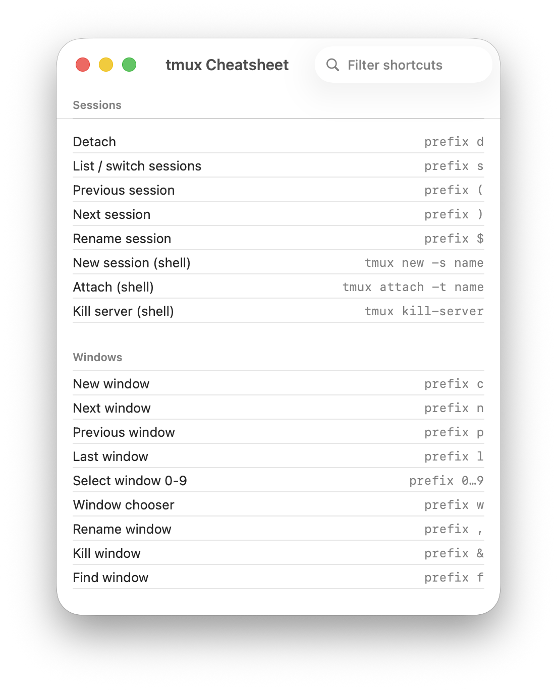

<p align="center">
  
</p>

<h1 align="center">Tmux Cheatsheet</h1>

<p align="center">
  A tiny, native macOS app: a searchable, click-to-copy reference of tmux shortcuts.
</p>

<p align="center">
  
  
  
</p>

---

Pure reference — it does **not** control tmux, run any processes, or touch other
apps — so it's fully **sandboxed** and **Mac App Store-eligible**.

It's a standalone companion to [Tmux Kit](https://github.com/semantic-craft/mac-tmux-kit)
(the full GUI manager), but shares no code or data with it — the two are
independent projects.

## Usage

- **Filter** as you type to find a shortcut by name, keys, section, or note.
- **Click a row** to copy its key sequence to the clipboard.
- **Summon from anywhere** with the global hotkey — default **⌘⌃⌥⇧C** (Hyper+C).
  Press it again to hide. Rebind it in **Settings** (⌘,).

## Screenshots

<p align="center">
  
</p>

## Build

```sh
# prerequisites: Xcode, XcodeGen (brew install xcodegen)
xcodegen generate
open TmuxCheatsheet.xcodeproj      # or: xcodebuild -scheme TmuxCheatsheet build
```

The app icon is generated by `scripts/make-icon.swift` (a keycap with a `?` —
tmux's `prefix ?` lists all key bindings).

## App Store

Sandboxed and submission-ready. Shipping it requires an Apple Developer Program
membership and an App Store Connect record (created under your own Apple account).

## License

[MIT](LICENSE).
